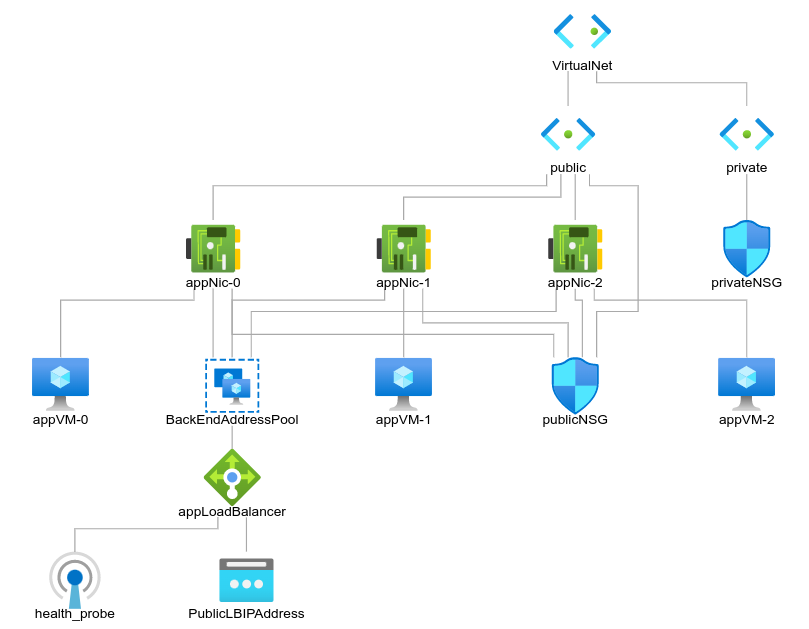

# <ins>Infrastructure as code project, wrote in terraform</ins>

## Requirements

| Name | Version |
|------|---------|
|  [terraform](#requirement\_terraform) | >=0.12 |
|  [azurerm](#requirement\_azurerm) | ~>2.0 |

## Providers

| Name | Version |
|------|---------|
|  [azurerm](#provider\_azurerm) | 2.99.0 |
|  [random](#provider\_random) | 3.3.1 |

## Modules

No modules.

## Resources

| Name | Type |
|------|------|
| [azurerm_lb.applb](https://registry.terraform.io/providers/hashicorp/azurerm/latest/docs/resources/lb) | resource |
| [azurerm_lb_backend_address_pool.backendaddresspool](https://registry.terraform.io/providers/hashicorp/azurerm/latest/docs/resources/lb_backend_address_pool) | resource |
| [azurerm_lb_probe.lbbtobe](https://registry.terraform.io/providers/hashicorp/azurerm/latest/docs/resources/lb_probe) | resource |
| [azurerm_lb_rule.lbrule](https://registry.terraform.io/providers/hashicorp/azurerm/latest/docs/resources/lb_rule) | resource |
| [azurerm_linux_virtual_machine.appvm](https://registry.terraform.io/providers/hashicorp/azurerm/latest/docs/resources/linux_virtual_machine) | resource |
| [azurerm_network_interface.appnic](https://registry.terraform.io/providers/hashicorp/azurerm/latest/docs/resources/network_interface) | resource |
| [azurerm_network_interface_backend_address_pool_association.nicbackendpool](https://registry.terraform.io/providers/hashicorp/azurerm/latest/docs/resources/network_interface_backend_address_pool_association) | resource |
| [azurerm_network_interface_security_group_association.appnicnsg](https://registry.terraform.io/providers/hashicorp/azurerm/latest/docs/resources/network_interface_security_group_association) | resource |
| [azurerm_network_security_group.privatensg](https://registry.terraform.io/providers/hashicorp/azurerm/latest/docs/resources/network_security_group) | resource |
| [azurerm_network_security_group.publicnsg](https://registry.terraform.io/providers/hashicorp/azurerm/latest/docs/resources/network_security_group) | resource |
| [azurerm_postgresql_flexible_server.postgres](https://registry.terraform.io/providers/hashicorp/azurerm/latest/docs/resources/postgresql_flexible_server) | resource |
| [azurerm_postgresql_flexible_server_configuration.postgres_off_require_secure_transport](https://registry.terraform.io/providers/hashicorp/azurerm/latest/docs/resources/postgresql_flexible_server_configuration) | resource |
| [azurerm_private_dns_zone.postgresql](https://registry.terraform.io/providers/hashicorp/azurerm/latest/docs/resources/private_dns_zone) | resource |
| [azurerm_private_dns_zone_virtual_network_link.postgresql](https://registry.terraform.io/providers/hashicorp/azurerm/latest/docs/resources/private_dns_zone_virtual_network_link) | resource |
| [azurerm_public_ip.loadbalancerip](https://registry.terraform.io/providers/hashicorp/azurerm/latest/docs/resources/public_ip) | resource |
| [azurerm_resource_group.rg](https://registry.terraform.io/providers/hashicorp/azurerm/latest/docs/resources/resource_group) | resource |
| [azurerm_storage_account.week5storageaccount](https://registry.terraform.io/providers/hashicorp/azurerm/latest/docs/resources/storage_account) | resource |
| [azurerm_subnet.privatesubnet](https://registry.terraform.io/providers/hashicorp/azurerm/latest/docs/resources/subnet) | resource |
| [azurerm_subnet.publicsubnet](https://registry.terraform.io/providers/hashicorp/azurerm/latest/docs/resources/subnet) | resource |
| [azurerm_subnet_network_security_group_association.privatensg](https://registry.terraform.io/providers/hashicorp/azurerm/latest/docs/resources/subnet_network_security_group_association) | resource |
| [azurerm_subnet_network_security_group_association.publicnsg](https://registry.terraform.io/providers/hashicorp/azurerm/latest/docs/resources/subnet_network_security_group_association) | resource |
| [azurerm_virtual_network.myterraformnetwork](https://registry.terraform.io/providers/hashicorp/azurerm/latest/docs/resources/virtual_network) | resource |
| [random_id.randomId](https://registry.terraform.io/providers/hashicorp/random/latest/docs/resources/id) | resource |

## Inputs

| Name | Description | Type | Default | Required |
|------|-------------|------|---------|:--------:|
|  [admin\_password](#input\_admin\_password) | n/a | `string` | `"123456789Al!"` | no |
|  [admin\_username](#input\_admin\_username) | n/a | `string` | `"ubuntu"` | no |
|  [name\_prefix](#input\_name\_prefix) | Prefix of the resource name. | `string` | `"postgresqlfs"` | no |
|  [number\_of\_vm](#input\_number\_of\_vm) | n/a | `number` | `3` | no |
|  [resource\_group\_location](#input\_resource\_group\_location) | Location of the resource group. | `string` | `"eastus"` | no |
|  [resource\_group\_name](#input\_resource\_group\_name) | n/a | `string` | `"project"` | no |
|  [resource\_group\_name\_prefix](#input\_resource\_group\_name\_prefix) | Prefix of the resource group name that's combined with a random ID so name is unique in your Azure subscription. | `string` | `"project"` | no |

## Outputs

| Name | Description |
|------|-------------|
|  [public\_ip\_address](#output\_public\_ip\_address) | n/a |
|  [resource\_group\_name](#output\_resource\_group\_name) | n/a |
